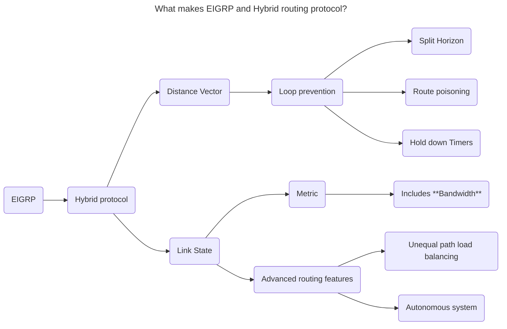

+++
title = 'Chapter 7'
date = 2024-10-05T15:18:51-05:00
draft = false
weight = 7
+++
# **EIGRP**
Do you know about the EIGRP ([rfc 7868](https://datatracker.ietf.org/doc/html/rfc7868)) protocol? Let's find out!

###### 1) Can you explain the main advantages of using EIGRP in a network?
{}
The main advantages of EIGRP include: 
- **fast convergence** due to the use of the Diffusing Update Algorithm (DUAL) and its partial updates.
- **scalability** in large networks, support for *unequal-cost load balancing*.
- **classless routing** Support for VLSM 
{}

###### 2) What type of routing protocol is EIGRP?
{}
EIGRP is a **hybrid** routing protocol, meaning it combines the characteristics of both **distance-vector** and **link-state** protocols. I is more efficient, supports faster convergence, and uses a composite metric based on bandwidth, delay, load, and reliability.EIGRP only exchanges information about paths and has lower overhead in large networks.

{}

###### 3) What is the purpose of the Diffusing Update Algorithm (DUAL) in EIGRP, and how does it work?
{}
The **Diffusing Update Algorithm (DUAL)** is used by EIGRP to ensure **loop-free** and **fast convergence**. It calculates the best path to a destination and maintains backup routes. DUAL continuously monitors the network and, if a failure occurs, it can rapidly switch to a feasible successor (backup route) without recalculating the entire topology.
{}

###### 4) What is the differences between a successor and a feasible successor in EIGRP?
{}
- A **successor** is the route with the lowest path metric to a destination and is installed in the routing table. 
- A **feasible successor (Backup route)** is a backup route that meets the feasibility condition (its reported distance is lower than the current feasible distance), and is kept in the topology table but not in the routing table unless the successor route fails.
{}

###### 5) How do feasible distance and reported distance impact EIGRP route selection?
{}
- The **feasible distance (FD)** is the lowest calculated metric to reach a destination from the local router. 
- The **reported distance (RD)** is the metric reported by a neighbor router for a particular route. 
For a route to be considered a feasible successor, its RD must be lower than the FD of the current successor, ensuring that no routing loops will occur.
{}

###### 6) What is a feasability condition?
{}
For a route to be considered a valid backup, it must meet the **feasibility condition**, which ensures that the backup route is loop-free. A route meets the feasibility condition if **reported distance** < **feasible distance** . This check prevents routing loops.
{}

###### 7) What are the different types of EIGRP packets, and what are their respective purposes?
{}
There are five types of EIGRP packets:
   1. **Hello**: Used to establish and maintain EIGRP neighbor relationships (sent every **5 seconds** on most networks and every **60 seconds** on low-bandwidth networks).
   2. **Update**: Used to send routing information to EIGRP neighbors.
   3. **Query**: Sent when a router needs to find an alternative path to a destination.
   4. **Reply**: Sent in response to a Query packet with information about an alternative path.
   5. **Request)**: Used to get specific information from one or more neighbors.
{}

###### 8) How does EIGRP converge when there is a change in the network topology?
{}
EIGRP recalculates routes using DUAL. When a topology change occurs, EIGRP checks if there is a **feasible successor** (backup route). If one exists, the route change is immediate. If no feasible successor exists, DUAL triggers the process of recalculating a new path from available route updates from neighbors.
{}

###### 9) What are the key metric components used by EIGRP to determine the best path to a destination?
{}
EIGRP uses a *composite metric* based on several factors:
   1. **Bandwidth** (minimum bandwidth along the path),
   2. **Delay** (cumulative delay along the path),
   3. **Reliability** (measured based on historical link quality),
   4. **Load** (current traffic load on the link).
By default, only bandwidth and delay are considered unless manually modified.
{}

###### 10) Can you explain how EIGRP performs unequal-cost load balancing, and how is it enabled?
{}
EIGRP supports **unequal-cost load balancing**, allowing traffic to be distributed across multiple paths with different metrics. This is enabled using the **variance** command, which multiplies the metric of the best path and allows other paths with a lower or equal metric (within the variance range) to be included in load balancing.
{}

###### 11) What is the default administrative distance of EIGRP?
{}
The default **administrative distance (AD)** for EIGRP routes depends on its source:
- **Internal EIGRP route**
   - source:  Internal routes are generated by routers running EIGRP within the same EIGRP EIGRP AS.
   - AD = 90
- **External EIGRP route**
   - Source: External routes can come from any non-EIGRP routing protocol, such as OSPF, BGP, static routes, or even another EIGRP process from a different AS.
   - AD = 170
{}

###### 12) Explain the role of the EIGRP topology table, and how does it differ from the routing table?
{}
The **topology table** contains all the known routes to a destination, including both successors and feasible successors. It keeps a complete record of all possible paths. The **routing table**, on the other hand, only contains the best (successor) routes that will be used for forwarding traffic.
{}

###### 13) Describe how EIGRP forms neighbor relationships and maintains neighbor stability.
{}
EIGRP forms neighbor relationships by exchanging Hello packets. When two routers exchange Hello packets and agree on common parameters (such as AS number, K-values, etc.), they establish a neighbor relationship and begin sharing route updates. Stability is maintained by continuously exchanging Hello packets to monitor link health.
{}

###### 14) How does EIGRP handle route summarization, and what are the advantages of using route summarization in a network?
{}
EIGRP supports both **manual and automatic route summarization**. Summarization reduces the size of the routing table by representing multiple networks with a single summary route, which reduces bandwidth usage for route updates and improves network efficiency.
{}

###### 15) What is the difference between manual and automatic route summarization in EIGRP, and how do you configure both?
{}
**Automatic summarization** (enabled by default in older versions of EIGRP) automatically summarizes routes at major network boundaries, whereas **manual summarization** allows more granular control by letting administrators specify summary routes at any point in the network. Automatic summarization can be disabled using `no auto-summary`, and manual summarization is configured with the `ip summary-address` command.
{}

###### 16) Can you explain the purpose of the passive interface feature in EIGRP, and in which scenarios would you use it?
{}
The **passive interface** feature prevents a router from sending **Hello packets** on an interface, effectively disabling EIGRP neighbor relationships on that interface while still allowing the network to be advertised. 
It is used in scenarios where a router is connected to a network but does not need to form EIGRP neighbor relationships, such as connecting to end-user devices.
{}

###### 17) When is a route said to be stuck in Active (SIA)?
{}
If a router does not receive a reply to its queries within a certain time, the route is declared **stuck in active** (SIA).
{}

###### 18) What command would you use to view the EIGRP topology table, and what information does it provide?
{}
use the commands:
- `show ip eigrp topology`  
- `show ipv6 eigrp topology` 

The commands display the EIGRP topology table, showing all the known routes, their feasible and reported distances, successors, and feasible successors.
{}

###### 19) What troubleshooting steps would you take if EIGRP neighbors are not forming as expected?
{}
   - To troubleshoot EIGRP neighbor issues:
   1. Verify matching AS numbers on both ends using `show ip eigrp interfaces`.
   2. Check the interface configurations and ensure both are not passive.
   3. Verify that Hello packets are being exchanged (`debug eigrp packets hello`).
   4. Ensure there are no mismatched EIGRP K-values (`show ip protocols`).
   5. Check for proper authentication (if enabled).
{}

###### 20) How do you verify EIGRP neighbor relationships, and what information can you gather from the `show ip eigrp neighbors` command?
{}
- `show ip eigrp neighbors`

   This command shows the state of EIGRP neighbor relationships, including the interface used, the neighbor's IP address, the hold time, uptime, and queue counts. This information helps confirm that the neighbors are stable and functioning properly.
{}

###### 21) What are the common reasons for EIGRP neighbor adjacency failures, and how can they be resolved?
{}
- Common reasons include:
- **AS number mismatch**.
- **K-value mismatch**.
- **Passive interfaces** preventing neighbor formation.
- **Authentication mismatch**.
- **Layer 2 connectivity issues** (e.g., link failures).
Solutions involve checking and correcting these parameters and ensuring proper network connectivity.
{}

###### 22) How do you enable and configure EIGRP authentication, and why is authentication important in EIGRP?
{}
 EIGRP authentication is enabled using **MD5 authentication** to secure EIGRP updates and prevent unauthorized routers from joining the EIGRP domain. Configuration steps include creating a key chain and applying it to the EIGRP interfaces with the `ip authentication mode eigrp` and `ip authentication key-chain eigrp` commands.
{}

###### 23) In EIGRP, there are **three main tables** that interact to facilitate the routing process:
{}
   1. **Neighbor Table**:
   - This table stores information about all the EIGRP neighbors that have been discovered on directly connected links. 
   - The neighbor relationship is established through the exchange of Hello packets, and this table maintains details such as the IP address of the neighbor, the interface through which the neighbor is reachable, and the hold time (the maximum time the router will wait before declaring a neighbor unreachable if Hello packets are not received).
   - Command to view: `show ip eigrp neighbors`

   2. **Topology Table**:
   - The topology table stores all the routes learned from EIGRP neighbors, including both feasible successors (backup routes) and successors (primary routes).
   - Each entry includes the **feasible distance** (the best metric to reach a destination), the **reported distance** (the metric reported by the neighboring router), and details about feasible successors, which are potential backup routes.
   - The topology table is essential for EIGRP's Diffusing Update Algorithm (DUAL), which determines the best path (successor) and any feasible successors for each destination.
   - Command to view: `show ip eigrp topology`

   3. **Routing Table**:
   - The routing table contains the best routes (successors) that are chosen by EIGRP and installed in the global routing table of the router.
   - EIGRP picks the best route from the topology table based on the lowest metric (feasible distance) and installs it into the routing table.
   - Only the routes that are deemed as the best (successors) are moved to the routing table.
   - Command to view: `show ip route`

   ### Interaction Between the Tables:
   - **Neighbor Table**: Keeps track of directly connected EIGRP neighbors.
   - **Topology Table**: Receives routing updates from neighbors and stores multiple potential routes. It uses the DUAL algorithm to identify the best route (successor) and feasible successors.
   - **Routing Table**: Once the best route is identified, it is installed in the routing table for actual forwarding of packets.

In summary, the neighbor table keeps track of neighboring routers, the topology table stores all potential routes learned from these neighbors, and the routing table holds the most optimal routes that are actively used for packet forwarding.
These answers cover a wide range of EIGRP topics that are critical for both technical interviews and certification exams.
{}