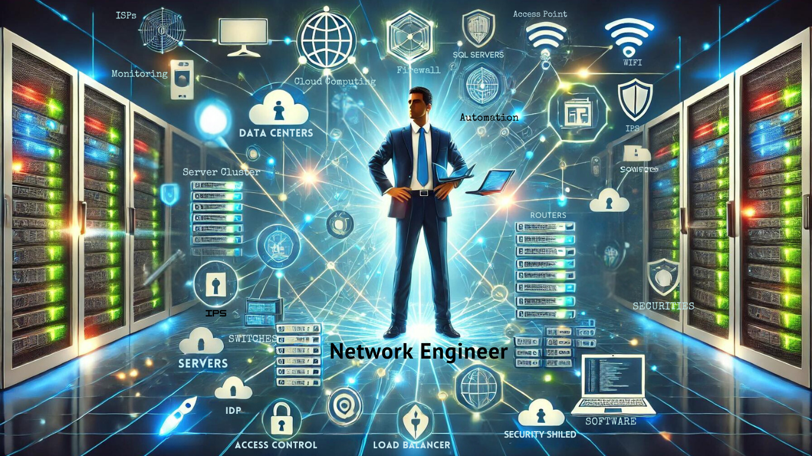

+++
archetype = "home"
title = ""
+++

## So you want to become a Network Engineer!

In today’s increasingly digital world, network engineers play a critical role in ensuring businesses function smoothly by maintaining the backbone of IT infrastructure: the Network. Their responsibilities cover designing, implementing, and securing networks that connect devices, applications. 

First and foremost, network engineers ensure **seamless communication** between various systems within an organization. They configure routers, switches, and other hardware to create efficient and reliable networks, allowing data to flow between computers, servers, mobile devices, and cloud services. In a time where real-time communication is essential for productivity, their work ensures smooth collaboration and interaction across different platforms and locations.

In addition to communication, **network security** is one of the most important aspects of a network engineer’s role. They protect an organization’s sensitive data by implementing firewalls, encryption protocols, and intrusion detection systems. With cyberattacks being a constant threat, network engineers ensure that networks are secure and compliant with industry regulations. Their efforts help prevent unauthorized access to data, reducing the risk of costly breaches and data leaks.

With the increasing popularity of **remote work** and **cloud infrastructure**, the role of the network engineer has evolved further. They are responsible for maintaining secure and efficient connections between on-premises systems, cloud platforms, and remote employees. As companies increasingly rely on cloud services and hybrid work environments, network engineers ensure that employees can work remotely without compromising security or performance.

A significant part of a network engineer’s role is ensuring **business continuity**. Downtime caused by network failures, disasters, or cyberattacks can result in significant financial losses and operational disruptions. Network engineers implement redundancy, disaster recovery solutions, and failover strategies to minimize downtime and ensure that businesses can continue to operate even in the face of unexpected challenges.

Another critical responsibility of network engineers is **scalability and future-proofing**. As businesses grow, their network needs also expand. Network engineers design networks that can scale with increasing demands, allowing for more users, additional data centers, and new technologies like IoT. By anticipating future growth and advancements, they ensure that a company’s network can handle new challenges as technology evolves.